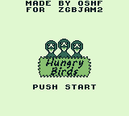
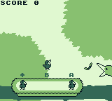
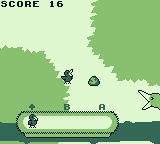
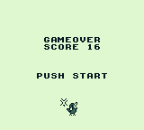

# Hungry Birds

A small Nintendo Game Boy game created in 48 hours for the ZGBJAM2 game jam. Made with C, GBDK, and [ZGB](https://github.com/Zal0/ZGB).

    

You control three chicks using the A (worth 3 points), B (worth 2 points), and UP (worth 1 point) buttons. Help the hungry chicks devour worms thrown by mother bird while avoiding the rocks.

=GOOD

=BAD

Be careful as the speed of the worms and rocks will increase with your score!

Download the Game Boy ROM file [here](bin/HungryBirds.gb).

To compile the code you'll need [ZGB](https://github.com/Zal0/ZGB).
